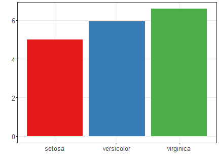
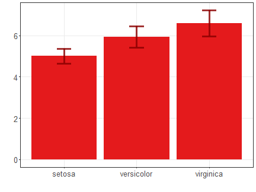
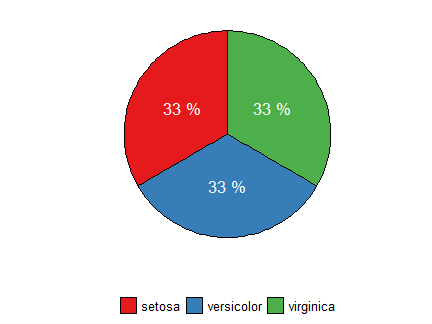
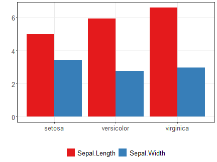
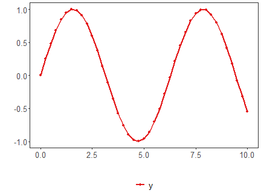
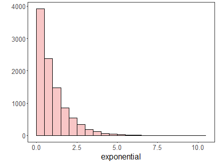
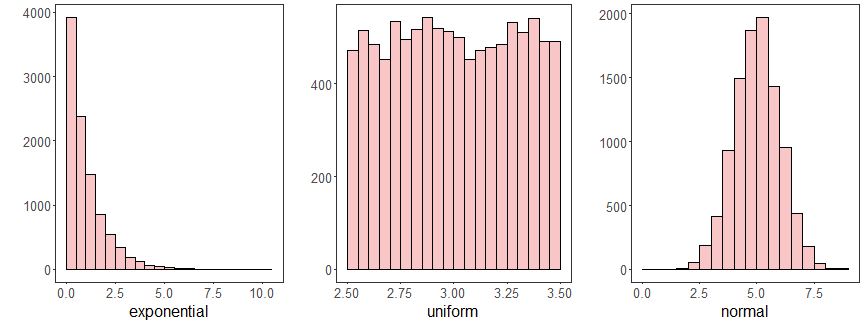
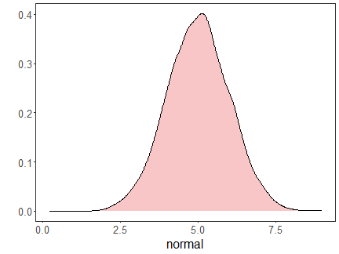
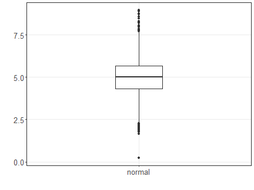

# Visualizacao de Dados

## Visao Geral
Este roteiro operacionaliza os exemplos do arquivo `03-DataVisualization.pdf`, conectando cada trecho de codigo ao slide de origem.  
O objetivo e mostrar como a escolha do grafico muda a interpretacao dos dados e como o `daltoolbox` simplifica a interface com o `ggplot2` (Wickham, 2016).  
Slides: 1.

## Como ler este roteiro
Para cada grafico, avalie sempre:
1. qual pergunta o grafico responde;
2. qual variavel esta no eixo x/y (ou categoria);
3. qual a principal limitacao visual daquele tipo de representacao.

## Configuracao e Bibliotecas
Slides: 2-7.


``` r
# Instalacao (executar apenas uma vez)
# install.packages("tidyverse")
# install.packages("ggplot2")
# install.packages("RColorBrewer")

library(daltoolbox)
library(ggplot2)
library(RColorBrewer)
```

Neste conjunto de exemplos, usamos o `iris` como base didatica para manter comparabilidade entre graficos.  
Slides: 7.


``` r
head(iris, 3)
```

```
##   Sepal.Length Sepal.Width Petal.Length Petal.Width Species
## 1          5.1         3.5          1.4         0.2  setosa
## 2          4.9         3.0          1.4         0.2  setosa
## 3          4.7         3.2          1.3         0.2  setosa
```

Configuramos paleta qualitativa do ColorBrewer para classes e um tema com fonte maior para leitura em aula.  
Slides: 5-6.


``` r
colors <- brewer.pal(4, "Set1")
font <- theme(text = element_text(size = 16))
```

## Grafico de Dispersao
Mostra relacao entre duas variaveis continuas e separacao por classe.  
Slides: 8.


``` r
data <- data.frame(
  x = iris$Sepal.Length,
  value = iris$Sepal.Width,
  variable = iris$Species
)
grf <- plot_scatter(data, label_x = "Sepal.Length", label_y = "Sepal.Width", colors = colors[1:3]) + font
plot(grf)
```


## Grafico de Barras
Resume uma estatistica por categoria; aqui usamos media por especie.  
Slides: 9.


``` r
agg <- aggregation("Species", Sepal.Length = mean(Sepal.Length))
data <- transform(agg, iris)
grf <- plot_bar(data, colors = colors[1:3]) + font
plot(grf)
```



## Lollipop
Alternativa ao grafico de barras, com menos area preenchida e foco na magnitude.  
Slides: 10.


``` r
agg <- aggregation("Species", Sepal.Length = mean(Sepal.Length))
data <- transform(agg, iris)
grf <- plot_lollipop(data, colors = colors[1], max_value_gap = 0.2) + font + coord_flip()
plot(grf)
```


## Barras com Erro
Acrescenta incerteza (desvio-padrao) ao valor medio, evitando leitura excessivamente deterministica.  
Slides: 11.


``` r
agg <- aggregation("Species", mean = mean(Sepal.Length), sd = sd(Sepal.Length))
data <- transform(agg, iris)
grf <- plot_bar(data, colors = colors[1], alpha = 1) + font
grf <- grf + geom_errorbar(data = data, inherit.aes = FALSE,
                           aes(x = Species, ymin = mean - sd, ymax = mean + sd),
                           width = 0.2, colour = "darkred", alpha = 0.8, size = 1.1)
plot(grf)
```



## Pizza
Util para composicao simples; para muitas categorias, barras costumam ser mais legiveis.  
Slides: 12.


``` r
agg <- aggregation("Species", n = n())
data <- transform(agg, iris)
grf <- plot_pieplot(data, colors = colors[1:3]) + font
plot(grf)
```



## Barras Agrupadas
Permite comparar mais de uma metrica para cada categoria.  
Slides: 13.


``` r
agg <- aggregation("Species",
  Sepal.Length = mean(Sepal.Length),
  Sepal.Width = mean(Sepal.Width)
)
data <- transform(agg, iris)

grf <- plot_groupedbar(data, colors = colors[1:2]) + font
plot(grf)
```



## Barras Empilhadas
Mostra total e composicao no mesmo eixo, com trade-off de precisao para comparar segmentos internos.  
Slides: 14.


``` r
agg <- aggregation("Species",
  Sepal.Length = mean(Sepal.Length),
  Sepal.Width = mean(Sepal.Width)
)
data <- transform(agg, iris)

grf <- plot_stackedbar(data, colors = colors[1:2]) + font
grf <- grf + theme(axis.text.x = element_text(angle = 90, hjust = 1))
plot(grf)
```


## Grafico de Linhas
Ideal para series ordenadas no tempo ou em eixo continuo.  
Slides: 15.


``` r
x <- seq(0, 10, 0.25)
serie <- data.frame(x, y = sin(x))

grf <- plot_series(serie, colors = colors[1]) + font
plot(grf)
```



## Distribuicoes
Antes de modelar, avaliamos forma, dispersao e presenca de assimetria/outliers.  
Slides: 16-17.


``` r
example <- data.frame(
  exponential = rexp(10000, rate = 1),
  uniform = runif(10000, min = 2.5, max = 3.5),
  normal = rnorm(10000, mean = 5)
)
head(example)
```

```
##   exponential  uniform   normal
## 1   1.4035595 3.000360 4.123129
## 2   0.4393723 2.545339 5.771283
## 3   0.7123922 2.564376 5.535298
## 4   0.2675336 2.902516 4.915892
## 5   1.4651363 3.212416 6.172643
## 6   0.3103093 3.305163 5.277370
```

### Histograma
Mostra frequencias por intervalo e e sensivel ao numero/largura de bins.  
Slides: 18.


``` r
data <- data.frame(exponential = example$exponential)
grf <- plot_hist(data, label_x = "exponential", color = colors[1]) + font
plot(grf)
```



### Histogramas Multiplos
Comparacao lado a lado para identificar diferencas de forma entre distribuicoes.  
Slides: 19.


``` r
{
  library(gridExtra)
  grfe <- plot_hist(data.frame(exponential = example$exponential), label_x = "exponential", color = colors[1]) + font
  grfu <- plot_hist(data.frame(uniform = example$uniform), label_x = "uniform", color = colors[1]) + font
  grfn <- plot_hist(data.frame(normal = example$normal), label_x = "normal", color = colors[1]) + font
  grid.arrange(grfe, grfu, grfn, ncol = 3)
}
```



### Densidade
Estimativa suavizada da distribuicao; util para comparar formatos sem depender de bins.  
Slides: 20.


``` r
data <- data.frame(normal = example$normal)
grf <- plot_density(data, label_x = "normal", color = colors[1]) + font
plot(grf)
```



### Boxplot
Resumo robusto com mediana, quartis e possiveis outliers.  
Slides: 21.


``` r
data <- data.frame(normal = example$normal)
grf <- plot_boxplot(data, colors = "white") + font
plot(grf)
```



## Boas Praticas de Uso em Aula
Ao usar estes exemplos em slides e laboratorio, mantenha tres vinculos explicitos:  
1. problema analitico (o que quero mostrar);
2. tipo de variavel (continua, categorica, temporal);
3. grafico escolhido e suas limitacoes.  
Slides: 22-23.

## Referencias
Slides: 24.

- Wickham, H. (2016). *ggplot2: Elegant Graphics for Data Analysis*. Springer.
- Wickham, H., Cetinkaya-Rundel, M., & Grolemund, G. (2023). *R for Data Science* (2nd ed.). O'Reilly.
- Wilke, C. O. (2019). *Fundamentals of Data Visualization*. O'Reilly.
- Brewer, C. A. (n.d.). ColorBrewer 2.0. https://colorbrewer2.org


