# Análise Exploratória de Dados (EDA)

Este roteiro apresenta exemplos práticos alinhados aos slides de `2-AnaliseExploratoria.pdf`.  
Cada chunk inclui um comentário com o **número do slide** correspondente.

## Como ler este roteiro
Use cada bloco com três perguntas-guia:
1. o que a visualização revela sobre distribuição/separação;
2. qual hipótese ela sugere para modelagem;
3. qual limitação ela possui (escala, sobreposição, outliers).


## Configuração


``` r
# Slides 1–3: contexto e objetivos da EDA
library(daltoolbox)
library(RColorBrewer)
library(ggplot2)
library(GGally)
library(gridExtra)
library(aplpack)

colors <- brewer.pal(4, "Set1")
font <- theme(text = element_text(size = 16))
```

Os helpers abaixo consolidam chamadas de visualização para manter os exemplos mais diretos.


``` r
# Funcoes helper foram movidas para o daltoolbox:
# plot_correlation(), plot_pair(), plot_pair_adv(), plot_parallel(), plot_pixel()
```

## Conjunto de Dados Iris


``` r
# Slides 11: O conjunto de dados Iris
head(iris[c(1:2, 51:52, 101:102), ])
```

```
##     Sepal.Length Sepal.Width Petal.Length Petal.Width    Species
## 1            5.1         3.5          1.4         0.2     setosa
## 2            4.9         3.0          1.4         0.2     setosa
## 51           7.0         3.2          4.7         1.4 versicolor
## 52           6.4         3.2          4.5         1.5 versicolor
## 101          6.3         3.3          6.0         2.5  virginica
## 102          5.8         2.7          5.1         1.9  virginica
```

## Estatísticas descritivas


``` r
# Slides 12–13: medidas descritivas básicas
sum <- summary(iris$Sepal.Length)
sum
```

```
##    Min. 1st Qu.  Median    Mean 3rd Qu.    Max. 
##   4.300   5.100   5.800   5.843   6.400   7.900
```

Com o resumo estatístico, calculamos o IQR para reforçar leitura de dispersão e potencial presença de outliers.


``` r
# Slides 14: quartis e IQR
IQR <- sum["3rd Qu."] - sum["1st Qu."]
IQR
```

```
## 3rd Qu. 
##     1.3
```

## Histogramas e densidades


``` r
# Slides 18: histograma
grf <- plot_hist(data.frame(Sepal.Length = iris$Sepal.Length),
                 label_x = "Sepal Length", color = colors[1]) + font
plot(grf)
```

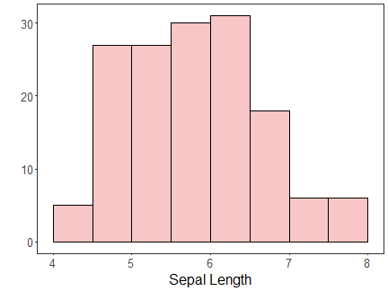

Em seguida, comparamos histogramas de todos os atributos para identificar diferenças globais de escala e formato.


``` r
# Slides 16–17: histogramas agrupados
grf1 <- plot_hist(data.frame(Sepal.Length = iris$Sepal.Length),
                  label_x = "Sepal.Length", color = colors[1]) + font
grf2 <- plot_hist(data.frame(Sepal.Width = iris$Sepal.Width),
                  label_x = "Sepal.Width", color = colors[1]) + font
grf3 <- plot_hist(data.frame(Petal.Length = iris$Petal.Length),
                  label_x = "Petal.Length", color = colors[1]) + font
grf4 <- plot_hist(data.frame(Petal.Width = iris$Petal.Width),
                  label_x = "Petal.Width", color = colors[1]) + font
grid.arrange(grf1, grf2, grf3, grf4, ncol = 2)
```

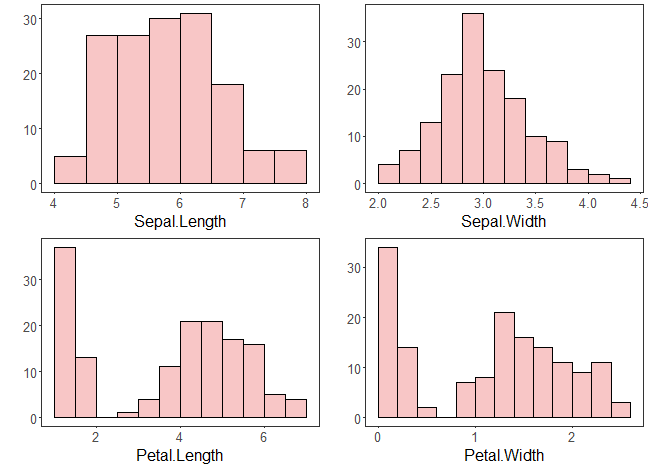

Depois da contagem por bins, avaliamos densidades para uma visão suavizada das mesmas distribuições.


``` r
# Slides 17: densidade
grf1 <- plot_density(data.frame(Sepal.Length = iris$Sepal.Length),
                     label_x = "Sepal.Length", color = colors[1]) + font
grf2 <- plot_density(data.frame(Sepal.Width = iris$Sepal.Width),
                     label_x = "Sepal.Width", color = colors[1]) + font
grf3 <- plot_density(data.frame(Petal.Length = iris$Petal.Length),
                     label_x = "Petal.Length", color = colors[1]) + font
grf4 <- plot_density(data.frame(Petal.Width = iris$Petal.Width),
                     label_x = "Petal.Width", color = colors[1]) + font
grid.arrange(grf1, grf2, grf3, grf4, ncol = 2)
```

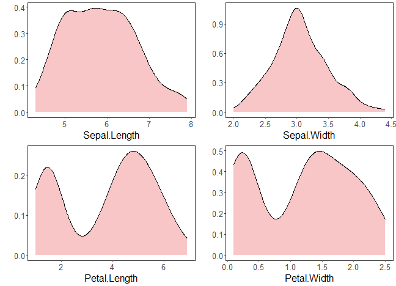

## Boxplots


``` r
# Slides 24: boxplot do Iris
grf <- plot_boxplot(iris, colors = colors[1]) + font
plot(grf)
```

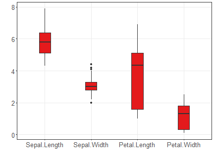

## Comparação por classe


``` r
# Slides 25: densidade com rótulo de classe
grfA <- plot_density_class(data.frame(Species = iris$Species, Sepal.Length = iris$Sepal.Length),
                           class_label = "Species", label_x = "Sepal.Length", color = colors[c(1:3)]) + font
grfB <- plot_density_class(data.frame(Species = iris$Species, Sepal.Width = iris$Sepal.Width),
                           class_label = "Species", label_x = "Sepal.Width", color = colors[c(1:3)]) + font
grfC <- plot_density_class(data.frame(Species = iris$Species, Petal.Length = iris$Petal.Length),
                           class_label = "Species", label_x = "Petal.Length", color = colors[c(1:3)]) + font
grfD <- plot_density_class(data.frame(Species = iris$Species, Petal.Width = iris$Petal.Width),
                           class_label = "Species", label_x = "Petal.Width", color = colors[c(1:3)]) + font
grid.arrange(grfA, grfB, grfC, grfD, ncol = 2, nrow = 2)
```

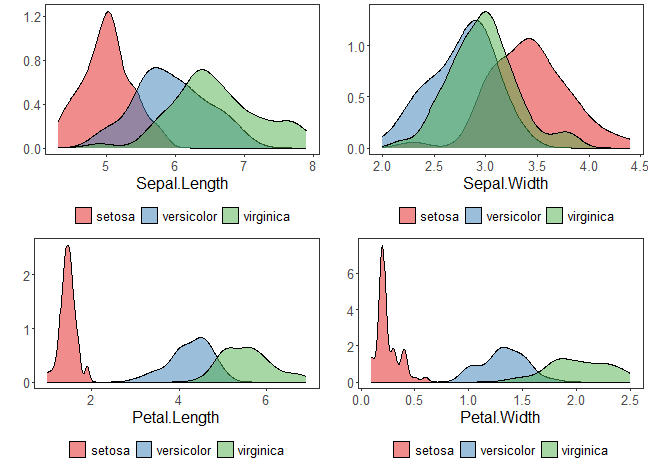

A leitura por densidade é complementada por boxplot por classe, destacando mediana, quartis e amplitude.


``` r
# Slides 26: boxplot com rótulo de classe
grfA <- plot_boxplot_class(data.frame(Species = iris$Species, Sepal.Length = iris$Sepal.Length),
                           class_label = "Species", label_x = "Sepal.Length", color = colors[c(1:3)]) + font
grfB <- plot_boxplot_class(data.frame(Species = iris$Species, Sepal.Width = iris$Sepal.Width),
                           class_label = "Species", label_x = "Sepal.Width", color = colors[c(1:3)]) + font
grfC <- plot_boxplot_class(data.frame(Species = iris$Species, Petal.Length = iris$Petal.Length),
                           class_label = "Species", label_x = "Petal.Length", color = colors[c(1:3)]) + font
grfD <- plot_boxplot_class(data.frame(Species = iris$Species, Petal.Width = iris$Petal.Width),
                           class_label = "Species", label_x = "Petal.Width", color = colors[c(1:3)]) + font
grid.arrange(grfA, grfB, grfC, grfD, ncol = 2, nrow = 2)
```

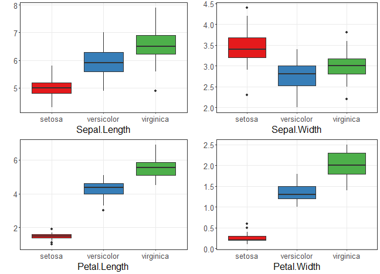

## Scatter plots


``` r
# Slides 28: grafico de dispersao
grf <- plot_scatter(data.frame(x = iris$Sepal.Length, value = iris$Sepal.Width, variable = "iris"),
                    label_x = "Sepal.Length") +
  theme(legend.position = "none") + font
plot(grf)
```

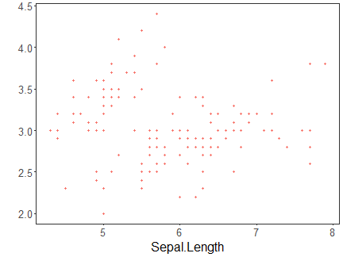

Agora incluímos classe no gráfico de dispersão para avaliar separabilidade visual entre espécies.


``` r
# Slides 29: grafico de dispersao com classe
grf <- plot_scatter(data.frame(x = iris$Sepal.Length, value = iris$Sepal.Width, variable = iris$Species),
                    label_x = "Sepal.Length", label_y = "Sepal.Width", colors = colors[1:3]) + font
plot(grf)
```

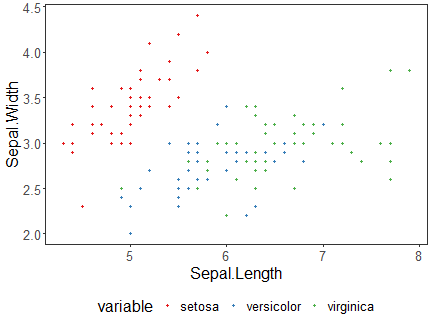

## Correlação e matrizes


``` r
# Slides 31: correlograma
grf <- plot_correlation(iris[, c("Sepal.Width", "Sepal.Length", "Petal.Width", "Petal.Length")])
grf
```

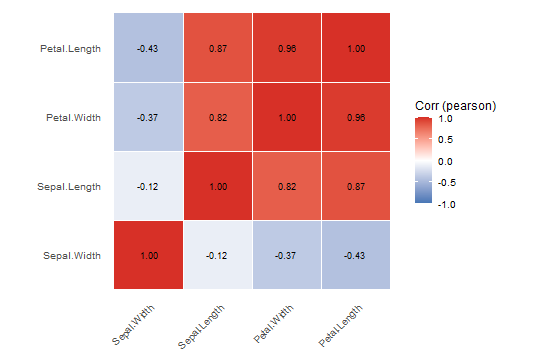

As próximas matrizes aumentam o detalhamento de relações par-a-par, com e sem informação de classe.


``` r
# Slides 32: matriz de dispersão
grf <- plot_pair(data = iris, cnames = colnames(iris)[1:4], title = "Iris", colors = colors[1])
print(grf)
```


Agora repetimos a matriz com rótulo de classe para destacar padrões de separação.


``` r
# Slides 33: matriz de dispersão com classe
grf <- plot_pair(data = iris, cnames = colnames(iris)[1:4], clabel = "Species", title = "Iris", colors = colors[1:3])
print(grf)
```

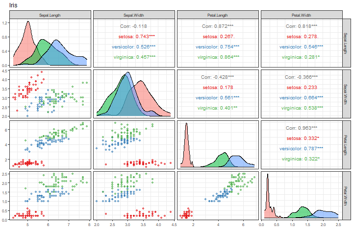

Em seguida, usamos a versão avançada para enriquecer leitura visual das relações.


``` r
# Slides 34: matriz de dispersão avançada
grf <- plot_pair_adv(data = iris, cnames = colnames(iris)[1:4], title = "Iris", colors = colors[1])
grf
```

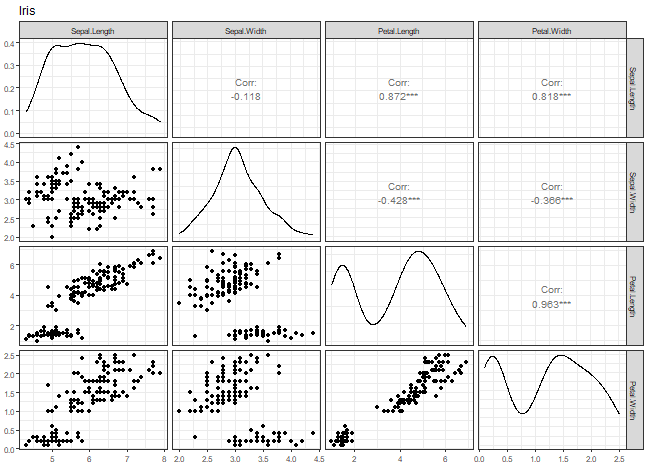

Por fim, combinamos versão avançada com informação de classe.


``` r
# Slides 35: matriz de dispersão avançada com classe
grf <- plot_pair_adv(data = iris, cnames = colnames(iris)[1:4], title = "Iris", clabel = "Species", colors = colors[1:3])
grf
```

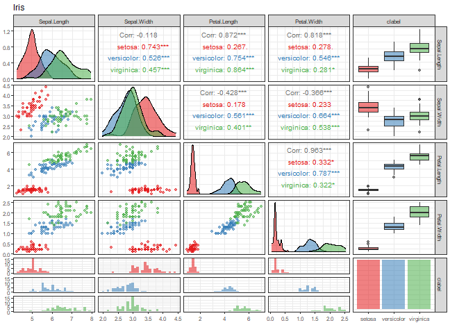

Na sequência, usamos representações multivariadas compactas para comparar padrões globais.

## Outras visualizações multivariadas


``` r
# Slides 37: coordenadas paralelas
grf <- plot_parallel(data = iris, columns = c(1:4), group = 5, colors = colors[1:3]) + font
plot(grf)
```

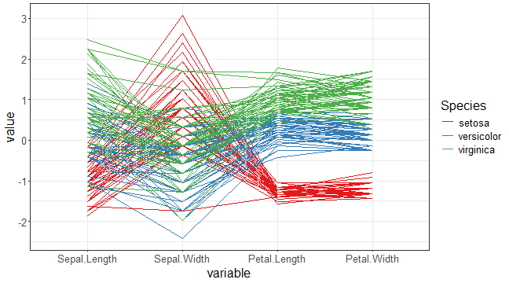

Complementamos com visualização orientada a pixels para comparar padrões de intensidade entre atributos.


``` r
# Slides 38: visualização orientada a pixels
grf <- plot_pixel(as.matrix(iris[, 1:4]), colors = brewer.pal(11, "Spectral"), title = "Iris")
plot(grf)
```

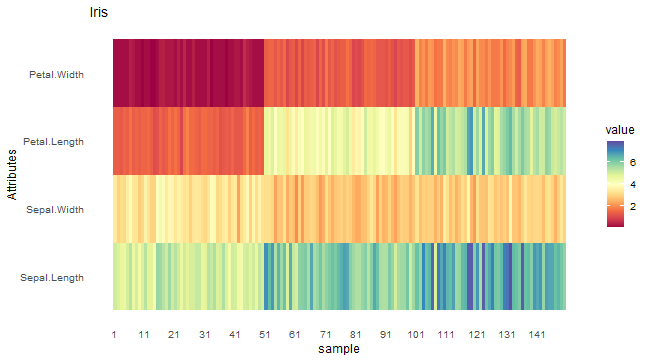

Fechamos com Chernoff Faces para uma leitura visual de perfis multivariados em amostras reduzidas.


``` r
# Slides 40–41: Chernoff faces
set.seed(1)
sample_rows <- sample(1:nrow(iris), 25)
isample <- iris[sample_rows,]
labels <- as.character(rownames(isample))
isample$Species <- NULL
faces(isample, labels = labels, print.info = FALSE, cex = 1)
```

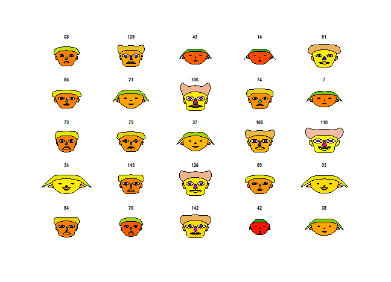

Por fim, repetimos com rótulos de classe para destacar diferenças intergrupos.


``` r
# Slides 42: Chernoff faces com classe
set.seed(1)
sample_rows <- sample(1:nrow(iris), 25)
isample <- iris[sample_rows,]
labels <- as.character(isample$Species)
isample$Species <- NULL
faces(isample, labels = labels, print.info = FALSE, cex = 1)
```

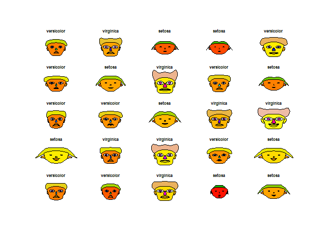

## Referências
- Tukey, J. W. (1977). *Exploratory Data Analysis*. Addison-Wesley.
- Cleveland, W. S. (1993). *Visualizing Data*. Hobart Press.
- Wickham, H. (2016). *ggplot2: Elegant Graphics for Data Analysis*. Springer.
- Friendly, M. (2002). Corrgrams: Exploratory displays for correlation matrices. *The American Statistician*.
- Inselberg, A. (1985). The plane with parallel coordinates. *The Visual Computer*.
- Chernoff, H. (1973). The use of faces to represent points in k-dimensional space graphically. *JASA*.


